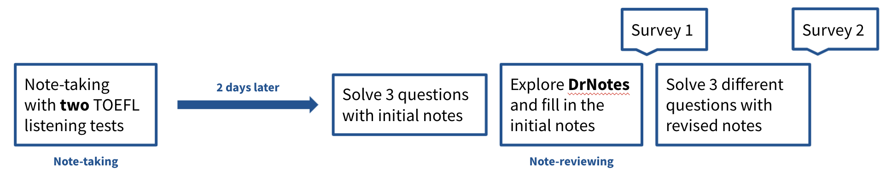
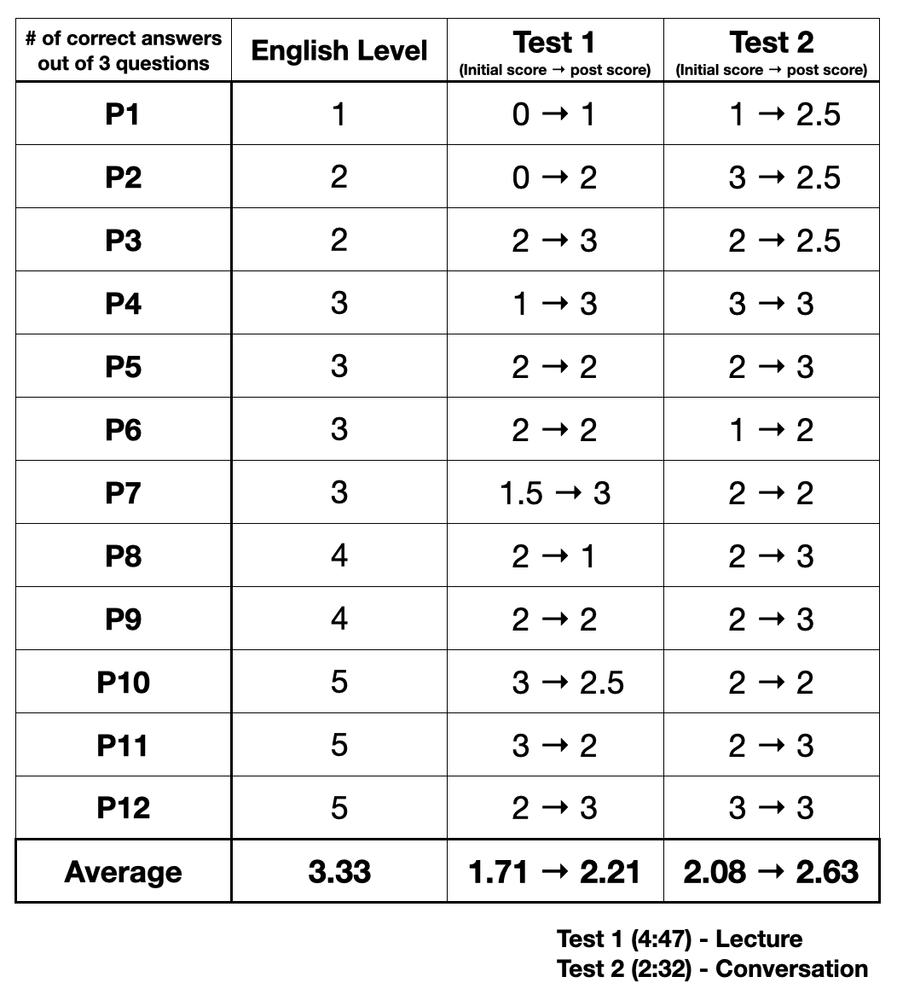
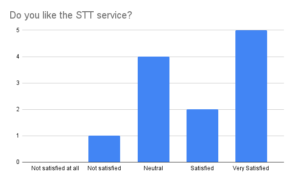
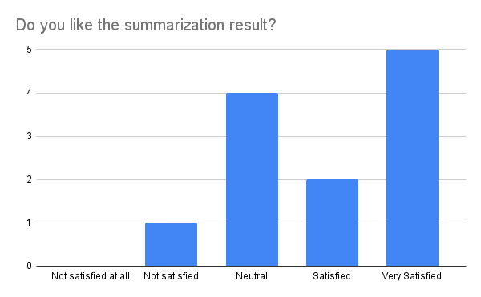

# Final Report

Team UFT - Junha Hyung, Hyunji Lee, Jeongeon Park

2021 Spring, CS492(E) Human-AI Interaction, KAIST

Link to Video: https://youtu.be/uQfXefMjBD8
Link to Prototype: https://drnotes-492e.web.app/
Link to Github: https://github.com/amy-hyunji/doctor-notes

---

## Quality Arguments

*Fig 1: Overview of DrNotes*

First of all, DrNotes is **neat and intuitive**. There are no standing-out colors, and when the user perceives three panels - *transcribed lecture recording, summarization, and my notes panels* - to be too content-heavy, they can always hide any panel and focus on the remaining ones [Fig 2]. All the interactive features such as the edit button or the threshold button are located on the top, and a single click of the *Export* button will download the note you re-created with DrNotes.

*Fig 2: The user can choose to hide any panels while using the system*

The contents are also designed to be **easily comprehensible** [Fig 3]. The lecture scripts, summarization and the user notes are divided as 50-second chunks to prevent the transcribed script look too long, and are aligned with the other panels for faster comprehension of the lecture. Furthermore, the summarization is given *in the form of bullet points* to align with the user notes, which are also taken as bullet points. As note-reviewing can be a time-consuming activity, we designed our system to **reduce the overall learning curve and the burden of looking at the contexts**.

*Fig 3: 50-second chunks and bullet point alignments*

When we asked the participants *"Was the system easy to use?"* during user testing, on a scale of 1-5 **the average response was 4.36**. There were many UI-related comments such as *"The UI was very neat"* or *"The +/- buttons to add or remove the notes were very intuitive."*

In DrNotes, we support **three Human-AI interactions**. 

The first interaction is **the lecture recording speech-to-text and summarization**, where the system takes the recorded file as input and outputs the transcription and the summaries. When the user fixes bad speech-to-text results, the system will then quickly re-summarize the lecture recording transcription and show back to the user. In addition, the user can inform the system of their preferred length of summarization in the first page [Fig 4].

*Fig 4: The intro page of the system. The user can put in a recording file, user note, and the preferred min/max length of summarization.*

The other two interactions support **summarization of the transcribed lecture recording** to fill in the initial user notes, one initialized by the system and the other by the user. 

Initialized by the system, the summary panel is shown to the user with a recommendation threshold button on the top [Fig 5], and the users are suggested from the system which summarizations are particularly important. When the user sets the threshold to "High", the minimum suggestions are given to the user.

*Fig 5: Summarization recommendation based on threshold*

As an opposite direction, when the user is not satisfied with the system recommendation, they can always drag parts of the transcribed lecture recording to ask system for more summarization [Fig 6]. With the system output, the user can either add the summary to fill in missing parts to their notes or ignore.

All interactions in DrNotes happen quickly in just a few seconds. During the user testing, many people enjoyed the drag-to-summarize interaction as they can *actively ask the system* for summarizations (n=3), as well as the fixing and re-summarizing the transcribed lecture recording interaction (n=2).

*Fig 6: Drag to summarize any parts of the lecture recording transcription*

---

## Evaluation
Our overall evaluation step was as follows [Fig 7]:
1. Users listened to two TOEFL listening tests and took notes.
2. After two days, the users solved randomly chosen three questions with the personal notes they took. 
3. They used the system to fill in the initial notes.
4. They solved non-overlapping randomly chosen three questions with the revised notes.
5. The users took two surveys after step 3 and after step 4, one regarding the usability of the system and the other regarding how DrNotes helped in note-reviewing.

*Fig 7: Overall evaluation pipeline. The participants took two different set of test with two different notes, the initial note and the DrNotes-assisted note.*

We designed the evaluation pipeline to simulate the actual note-taking and note-reviewing process. We left a two-day gap between the note-taking and the note-reviewing to see if the system could help in long-term memory, and assessed with randomly-selected non-overlapping three-question test set to minimize the dependency on the difficultly of the questions. 

We chose TOEFL listening tests as our evaluation task for several reasons. First, we had to limit the length of the audio file because we are paying Google API for speech-to-text (STT) service and the long file transfer time. Second, using a 75-minute lecture for evaluation was too long for the participants. Also, as TOEFL listening tests contain question-answer sets generated by experts, we were able to quantitatively assess the usefulness/helpfulness of DrNotes. 

The two TOEFL test we used was 4:47 and 2:23 minutes long, respectively. The first test was a lecture about the US government, and the other was a conversation between a student and a college counselor.

We conducted the experiment with 12 participants, with diverse English level and note-reviewing methods. One common ground was that they all have experienced difficulty in note-reviewing later, as they tend to forget the context of the notes and the lecture.

As shown in Fig 8, we saw an overall increase in test scores with the help of DrNotes. The increase in score was 0.5 and 0.55 point increase respectively. This shows that the system worked as we expected, helping the note-reviewing process and in comprehending the contents. Some drops in scores were more commonly seen from better English speakers, and we think this was caused because only three questions were given and it was easy to miss one question.

*Fig 8: Change in test scores using the initial note and the DrNotes-assisted note, as well as each participant's English level*

When we asked the participants how much they were satisfied with the model results, the average score was 3.83 for STT and 3.91 for summarization [Fig 9,10]. This shows that the performance of the model is decent, but not ideal. 75% of the participants preferred the DrNotes-assisted note over the initial note.

*Fig 9: Satisfaction score of the STT model*

*Fig 10: Satisfaction score of the summarization model*

When we asked the pros of DrNotes, participants commented that the neat UI, summarization recommendation, and the drag-to-summarize was their favorite. One (P3) commented that "DrNotes reduces the burden and the anxiety of good note-taking". On the other hand, some cons mentioned were not ideal model performance and the time it takes to use the system to re-create the notes. We thought that it would have been better if measure the time it took each participant to use the system.

---

## Discussion
Stated in the Quality Argument section, DrNotes have three main Human-AI interactions: (1) the text-to-speech conversion of the lecture recording which can be later edited by the user, (2) The summary recommendation from the system based on thresholds, and (3) the drag-to-summarize requested by the user and performed by the machine. An additional minor interaction is asking the user to specify the length of the summarization at the beginning. 

#### Good Human-AI interaction complements the not-as-perfect model performance
We used three models in DrNotes, speech-to-text (STT), summarization, and similarity measure model. Although we experimented with several SOTA models, all the available STT models showed bad performance. Therefore we had to use a paid Google STT API which was still not perfect. Our summarization model also was not perfectly fine-tuned to the lecture context. Thus, before the evaluation we were concerned that the not-ideal performance of the model could lead to a bad user experience towards the system. 

However, during the evaluation we realized that having a good interaction component with the model complements the imperfect model performance. When the user did not like the recommended summarization from the model, they would just drag some parts of the script and summarize to add to their notes. The same applied to STT, where people liked that they could edit the incorrect transcription and ask the machine to re-summarize the script.

#### Building trustful models is important, and this can be done by adding explanations
Interestingly, we observed that one unfaithful result from the model instantly led the user to distrust the whole system. When a user (P10) encountered two bad summarization from the system, they ignored the remaining recommendations. On the other side, when the user built a certain level of trust, it led to the user replacing most of their notes with the system recommendation (P6). 

We thought that one way to build trust with the system is to provide explanation with the output. While one participant (P11) was trying out different summarizations by dragging, they realized that some summarization began with random people's name, and was wondering why. A short explanation saying that "the summarization may include random name as the model learned based on a conversation dataset", the trust would not have went down this much.

#### The preferred level of freedom in the interaction varies between different users
Another phenomenon we observed was that people have different preferences towards how much they can control the system. For example, some enjoyed filling out the min/max length of summarization as it allows them to sync the output with their notes, while others preferred a default, fixed min/max value. This applied in the threshold-based recommendation as well, where one (P9) mentioned that "exploring recommendations based on threshold is simply time-consuming". With diverging opinions towards the threshold-based recommendation, the average helpfulness score provided (scale 1-5) was 3.38.

As our project focused on assisting the note-reviewing process, the domain itself relatively did not have much room for ethical or privacy considerations.

---
## Individual Reflections
### Junha Hyung
* What worked well and not in your team? How did you overcome any hurdle in teamwork? What lesson about teamwork did you learn that you might apply to your next team project? Through the team-based design project experience, what did you learn about human-AI interaction and web-based implementation?
    * Everyone was hard working and responsible for their own tasks. This made teamates to trust and rely on each other, and thus enabled us to focus on the task. Also while we divided tasks, everyone was relatively aware of each other's tasks: HCI and AI. 
    * Difficult thing was first of all, topic selection and ideation. We had to come up with novel task that could be made in a month. Communication was also difficult. Because we were communicating with Zoom, it was very easy to understand each other's words in different way. 
    * I learned that precise communication was very important: 1) You need to be very brief about your argument and always need evidence for it. 2) Visualizing your ideas is important. 3) Modularizing the task and defining API is extremely important.
    * Finally, I learned that 'human' is the most important in human-AI interaction. Starting with the technology would not work most of the times. Starting with the human needs and finding the technology that can solve it will lead to great service. And that technology might not be AI in some cases, so you don't need to rely on AI in every part of your service.

### Hyunji Lee
* What worked well and not in your team? How did you overcome any hurdle in teamwork? What lesson about teamwork did you learn that you might apply to your next team project? Through the team-based design project experience, what did you learn about human-AI interaction and web-based implementation?
    * We had some difficulty on server side since there weren't anyone who had experience in it, but we could solve the issue by working together. Also, due to COVID-19, we couldn't see each other so there were some difficulty on communication, but we tried to contact each other when there were any special cases or when we need help. Though our role was divided quite clearly, we tried to help each other when there are any issues. I think clear division of role and each other's interest was one of our team's strength and weakness. Each could explain to the others about why they chose certain decisions and could work at their own pace. However, we did try to help together, but there were some limitation on helping each other since we didn't have much experience on other's parts. I mostly learned from this teamwork about how to communicate to each other efficiently without meeting each other.
    * It was my first time creating something that looks like a product that users can actually use. Deciding which model to use, training them, or getting higher validation score was not difficult but rather considering how the product would help the users or what kind of interactions was a difficult decision. Talking with teammates and listening to the users by user-study helped me a lot in realizing once more that there are various users out there that have different thoughts from me and it is hard to predict or consider all.
    * This design project was a meaningful experiment in that I could tried lots of new things. Since I mostly study and have interest in AI, I tend to mainly focus on things that would help AI learn better so that it would result in better accuracy. However, by taking the class and working on design project, I tend to think more about what kind of side-effects this could lead to humans or how the model or how the human would be able to get help by each other.

### Jeongeon Park
* What worked well and not in your team? How did you overcome any hurdle in teamwork? What lesson about teamwork did you learn that you might apply to your next team project?
  * The role was very well split in our team as we had very different specialities (e.g. I had experience in HCI as well as web programming, and the other team members had specialities in ML). This worked as a plus when we had in-depth discussions, for example when we talked about the specifics of the model such as the input length or the threshold or when we talked about narrowing down the problem statement. Also, the different backgrounds were helpful in the ideation part as the team could bring in diverse ideas.
  * However, the varying background and speciality was sometimes difficult because everyone had different priorities in developing the system. For example, while I was more concerned about how the script and the notes are displayed to the user, others were more concerned about fine-tuning and accomplishing a better model performance. The difference in the perspective was very new to me at the beginning, but through **light and frequent discussions** we were able to reach a consensus. Also, although COVID-specific, not being able to meet the teammates in person obviously made the teamwork more difficult.
* Through the team-based design project experience, what did you learn about human-AI interaction and web-based implementation?
  * I personally think that I improved a lot through the web-based implementation, in terms of both communicating the front-end with the server and the front-end, by learning Hook in React. Another thing I learned was that making detailed decision (e.g. each method and what information will the method transfer) within the team is important before moving onto the actual implementation, or else the team will go back and re-do the implementation from the beginning.
  * I also learned that there are **many many** things to consider in designing a good human-AI interaction. Often, the users have high expectations towards AI and one small mistake may lead the user to lose trust towards AI. While now I get the overall sense of how human-AI interaction should be designed and what needs to be considered, I believe that a deeper investigation into each component of the interaction will result in a more careful design. (e.g. how much room for freedom/interaction we should provide to the user, how does the accuracy - trust tradeoff graph look like)